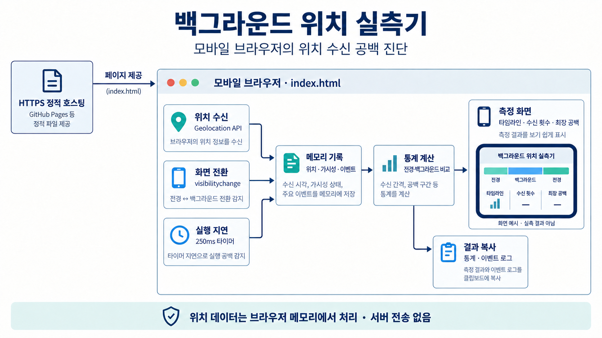
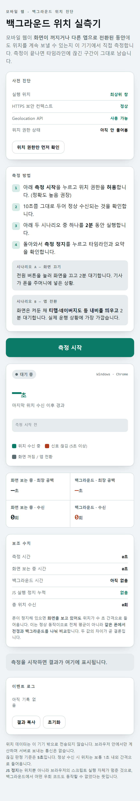

# 모바일 웹 백그라운드 위치 실측기

모바일 브라우저에서 화면을 끄거나 다른 앱으로 전환했을 때 위치 수신이 얼마나 끊기는지 비교하는 진단 도구입니다. 같은 기기의 전경·백그라운드 구간을 나눠 수신 횟수와 최장 공백을 표시합니다.

## 주요 기능

- 위치 API 지원, 보안 컨텍스트, 권한 등 실행 환경 진단
- Geolocation watchPosition으로 위치 수신 시각 기록
- visibilitychange로 페이지가 보이는 구간과 숨겨진 구간 구분
- 위치 수신·공백·백그라운드 구간을 Canvas 타임라인에 표시
- 전경·백그라운드별 수신 횟수, 측정 시간, 최장 공백 비교
- 타이머 지연 감지와 이벤트 로그
- 측정 결과를 텍스트로 복사

## 아키텍처

[ index.html ](./index.html) 하나에서 위치 수신, 페이지 가시성, 타이머 지연을 기록하고 통계와 화면을 갱신합니다.



호스팅은 페이지를 제공하는 역할이며 위치를 수집하는 서버 API는 없습니다. 측정 기록은 페이지 메모리에 남고, 결과 복사에는 좌표 자체를 포함하지 않습니다. 그림의 구성 요소는 한 HTML 파일 안의 역할을 나눈 것으로 별도 서비스가 아닙니다.

## 실행 화면

저장소의 index.html을 **Windows Chromium에서 모바일 폭(430px)**으로 실행한 실제 캡처입니다. 위치 권한을 요청하기 전의 대기 상태이며, 휴대전화의 백그라운드 실측 결과는 아닙니다.

사전 진단 → 측정 안내 → 시작 버튼 → 타임라인·통계 → 이벤트 로그 순서로 구성되어 있습니다.

<p align="center">
  
</p>

[원본 크기로 보기](./docs/images/screen-idle.png)

## 측정 방법

1. 모바일 브라우저에서 HTTPS로 제공되는 페이지를 **직접** 엽니다.
2. 사전 진단과 위치 권한을 확인하고 측정을 시작합니다.
3. 화면을 켠 상태에서 정상적으로 위치가 수신되는지 확인합니다.
4. 화면을 끄거나 다른 앱으로 전환한 상태로 약 2분 유지합니다.
5. 페이지로 돌아와 측정을 정지하고 타임라인·수신 횟수·최장 공백을 비교합니다.

화면 끄기와 앱 전환은 별도 측정으로 비교하는 것이 좋습니다. 결과를 보관할 때 기기·OS·브라우저 버전, 측정 시나리오, 절전 설정도 함께 기록하면 재현 조건을 확인할 수 있습니다.

## 실행 환경

[ index.html ](./index.html)에 HTML·CSS·JavaScript가 모두 포함되어 있습니다. 별도의 패키지 설치나 빌드 과정은 없습니다.

모바일 실측에는 HTTPS 정적 호스팅을 사용합니다. 브라우저 위치 API에는 보안 컨텍스트와 사용자의 위치 권한이 필요합니다. iframe에서 실행하면 권한 정책에 영향을 받을 수 있으므로 새 탭에서 직접 엽니다. [Geolocation API 안내](https://developer.mozilla.org/en-US/docs/Web/API/Geolocation/watchPosition)

PC에서 화면과 기본 동작을 확인하려면 저장소 루트에서 다음과 같이 실행할 수 있습니다.

```bash
python -m http.server 8000 --bind 127.0.0.1
```

같은 PC의 브라우저에서 `http://localhost:8000`을 엽니다. 휴대전화에서 PC의 일반 HTTP 주소에 접속하는 방식은 모바일 위치 실측 환경으로 사용하지 않습니다.

## 측정 기준

| 항목 | 현재 코드 기준 |
| --- | --- |
| 위치 공백 표시 기준 | 5초를 넘는 수신 간격 |
| 위치 요청 | 고정밀 요청, 캐시 최대 수명 0, 타임아웃 30초 |
| 타이머 | 250ms 간격 |
| 스크립트 실행 지연 감지 | 타이머 간격이 2초를 넘을 때 기록 |
| 자동 판정의 중단 조건 | 백그라운드 최장 공백이 전경의 2배를 넘고 30초도 초과할 때 |

화면에서는 백그라운드 측정 2분을 권장하지만, 현재 자동 판정 코드는 60초 미만 구간을 짧은 측정으로 처리합니다. 결과 문구와 함께 실제 측정 시간과 수치를 확인해야 합니다.

## 결과 해석의 한계

- 위치 수신 주기는 브라우저·기기·위치 환경에 따라 달라집니다. 5초 공백은 이 도구의 기준이며 운영체제의 차단을 확정하는 값은 아닙니다.
- 타이머 지연은 스크립트 실행 지연의 간접 지표입니다. 백그라운드 제한이나 기기 부하 등 원인을 이 기록만으로 구분할 수 없습니다.
- 페이지의 가시성으로 구간을 나누므로 화면 잠금과 앱 전환을 자동으로 구별하지는 않습니다.
- 자동 판정은 현재 기기의 이번 측정에 대한 간단한 규칙입니다. 모든 모바일 환경에서 위치 추적이 가능하거나 불가능하다는 결론으로 일반화하지 않습니다.
- 위치 수신이 0회이면 권한·환경 문제부터 확인해야 합니다.
- 저장소에는 기기별 실제 측정 결과가 포함되어 있지 않습니다. 이번 README 정리는 코드의 구현 범위를 설명합니다.

## 데이터 처리

좌표와 수신 기록은 페이지 메모리에서 처리하며, 코드에는 위치를 서버로 보내는 요청이 없습니다. 새로고침하면 측정 기록이 사라집니다. 결과 복사는 통계와 이벤트 로그를 텍스트로 내보내며 좌표 자체는 포함하지 않습니다.

## 파일 구성

- [index.html](./index.html): 진단 UI와 측정 로직
- [.nojekyll](./.nojekyll): GitHub Pages의 Jekyll 처리 비활성화
